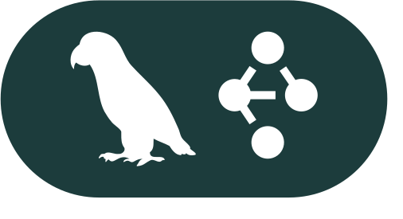

	
	 

 

	
	
	
	
	

 
 

	

 

  

  
<h3 align="left">👩‍💻 About Me</h3>

 I'm Shiv Arora from India, exploring the world of Artificial Intelligence one model at a time.
	 
		  - 🔭 I’m working as an AI/ML developer building intelligent systems and creative solutions.
			  - 📚 I'm currently learning deep learning tricks, MLOps magic, and everything that makes AI actually work.
				  - ⚡ In my free time I train models, break them, fix them again, and occasionally touch grass. 
				
  
				<h3 align="left">🛠 Language and tools</h3>  
				

					
					
					
					
					
					
					
					
					
					
					
					
					
					
					
					
					
					
					
					
					
					
					
					
					
					
					
					
					
					
					
					
					
					<!--  -->
					<!--  -->
				
  
				<h3 align="left">🔥 My Stats :</h3>  
				

					
                      
					
				

  
				

  

